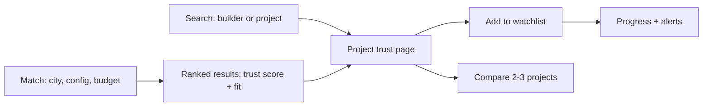

# Design

How the verify + match idea becomes actual screens and flows.

## Principles & core flow

This is a due-diligence tool, not a listings marketplace — it should read like a trustworthy public-record lookup (closer to a court-records search or a credit report) rather than a real-estate sales site. Plain language over jargon, every number sourced and dated, nothing that looks like an ad.

## Key screens

- **Search / Match home** — one form: city, configuration, budget range; a secondary "search by builder or project name" for direct lookup.
- **Project trust page** — the core screen: a trust score, a plain-language delivery history ("4 of 9 past projects on time, 5 delayed 8–14 months"), open/resolved complaints with one-line plain-English summaries linking to the original order, and (if tracked) a progress-vs-promise chart from quarterly filings.
- **Compare view** — 2–3 project trust pages side by side, same fields aligned as rows.
- **Watchlist** — saved projects with a status chip (on track / delayed / new complaint) and a simple activity feed.

## Content & trust-signal design notes

- Every number on the trust page links to its source filing — non-negotiable, both for credibility and to avoid overstating what's actually known.
- The trust score should show as a simple, explainable breakdown (delivery history, complaint volume, progress-vs-promise), never a single unexplained number — buyers need to see why a score is what it is.
- Timestamp everything ("as of \[date\]") since RERA filings update quarterly, not live.
- Avoid anything that reads as a sales pitch — no "featured" builders, no ads; the whole point is that this isn't the builder's own marketing.
