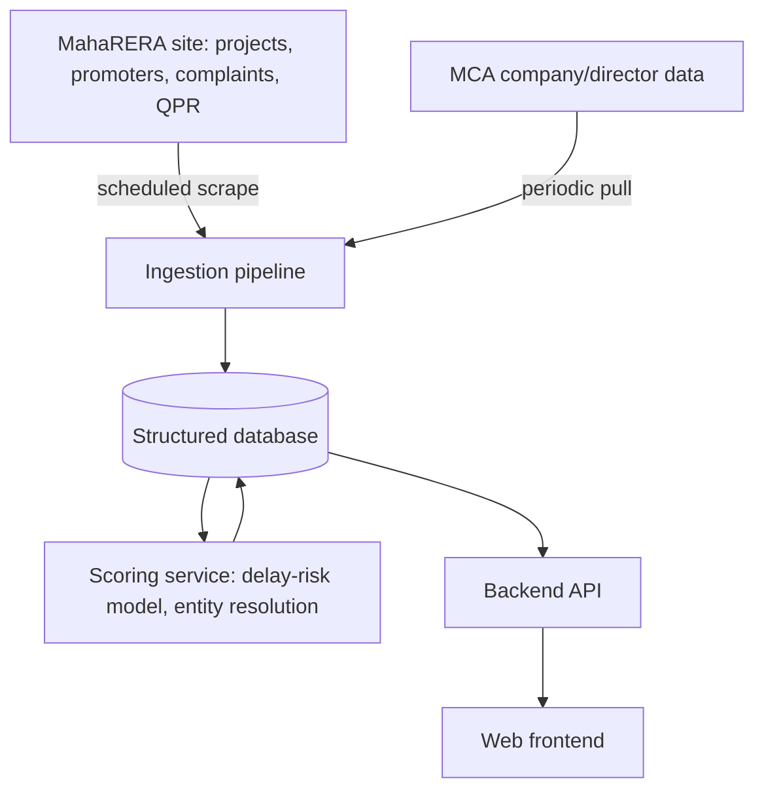

# Tech Stack

What this is actually built with, so it's ready to hand to Claude Code.

## Architecture overview

## Data pipeline

- Scheduled scraper (e.g., Playwright/requests + BeautifulSoup) against MahaRERA's and Karnataka RERA's project, promoter, and complaint search pages, plus each state's quarterly progress reports (QPR) — run weekly, not real-time, since the underlying filings are quarterly anyway.
- Store raw scraped pages alongside parsed/structured records, so a source can always be re-shown or re-parsed if a site's layout changes.
- Build one scraper adapter per state rather than a single hardcoded scraper — Maharashtra's and Karnataka's portals are structured differently, and this pattern is what makes adding a third state later a smaller job instead of a rewrite.
- A separate, slower pipeline against MCA (Ministry of Corporate Affairs) public company/director data to support entity resolution — this is the piece that needs the most care, since it's matching, not just parsing.

## Backend, database, frontend

- **Backend**: Python (FastAPI) — pairs naturally with the scraping/ML pipeline also being Python, keeping one language across ingestion, scoring, and API.
- **Database**: PostgreSQL — relational fits this data well (builders → projects → complaints → quarterly filings is naturally relational), and it's available free-tier (Neon, Supabase), the same way Dekho already uses it.
- **Frontend**: React + Vite + Tailwind — consistent with the stack you already know from Dekho and the portfolio site, no new framework to learn just for this.

## AI/ML components & hosting

- **Delay-risk model** — a gradient-boosted or simple regression model trained on completed projects (known outcome) to score ongoing ones. Start simple (a scored checklist) and only move to a trained model once there's enough labeled historical data to justify it.
- **Entity resolution** — match builders across separate legal entities via shared directors/registered addresses (from MCA data). Likely rule-based/fuzzy-matching first, graph-based only if the simple version proves too noisy.
- **Complaint summarization** — an LLM (Claude) to turn dense tribunal orders into one-line plain-English summaries, always shown next to a link to the original document.
- **Hosting** — free-tier-friendly, matching the no-budget approach already used on the grid-scheduler project: Vercel/Render for the app, a scheduled free-tier job (GitHub Actions) for the scraper, rather than any paid infrastructure until the MVP proves out.
